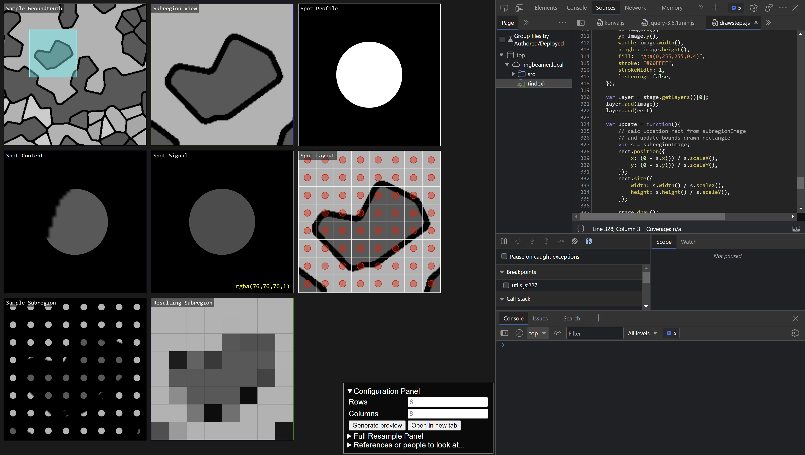

# ImageProbeSampler

### To Do
0. [+]sample groundtruth / map nav
2. subregion / zoomed view
1. spot profile
3. Spot content
4. Spot signal (rgba)
5. Spot layout
6. sampled subregion
7. Resulting subregion
8. [+]Resulting image (full) - could be auto-scale or

- Update row by row
- add labels
- updated terms

 
### Screenshot

