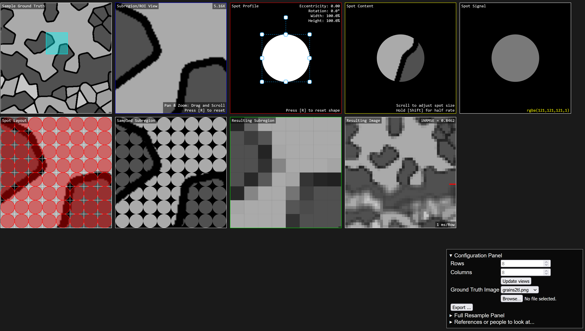

# ImgBeamer

Try it live [here](https://joedf.github.io/ImgBeamer/app/index.html), no setup or installation required!

Simple demo tool of the image formation[1](#references) process used in a Scanning Electron Microscope (SEM).

### Description of Stages / Boxes
1. Sample Ground Truth (map navigation)
2. Subregion/ROI (Region of Interest) View ("zoomed" view)
3. Spot Profile
4. Spot Content
5. Spot Signal (rgba)
6. Spot Layout
7. Sampled Subregion
8. Resulting Subregion
9. Resulting Image (full, "virtual SEM")
 
### Screenshot

### Notes
- Minor pixel value differences in virtualSEM; improved, but could be due to sampling from downsized sampling of the larger full image
- The application design is being documented [here](https://github.com/joedf/CAS741_w23).

### Developer Instructions and Notes
- The main application is implemented entirely in javascript
	- You can run it either using the auto-deployed GitHub pages version ("live" link above).
	- Or you can run it on your own machine with a local web server pointed to the `app/` folder
		- either [XAMPP](https://www.apachefriends.org/) or even just a python HTTP server with `python -m http.server --directory app/`
- Tests for the image metrics are available under `tests/`:
	- `og` is code for "original" (unmodified) image, and `fant` refers to a down-sampled image using Fant's algorithm[2](#references).
	- `js-tests/`: for javascript implementations
		- open the `index.html` page (using a local web server as described above) and look in the webconsole.
		- mainly in the webconsole, you can use `run_all(fant)` where if `fant` is true, all the image comparison tests will be run using the "fant-sampled" image as the ground truth. Otherwise (false), it will use the "original" image as the ground truth instead.
	- `py-tests/`: for python implementations
		- run `imgquality.py`
	- The other folders and files are from preliminary and manual testing that was done in the past.

### References
1. “Image Formation.” In Scanning Electron Microscopy and X-Ray Microanalysis, edited by Joseph I. Goldstein, Dale E. Newbury, Joseph R. Michael, Nicholas W.M. Ritchie, John Henry J. Scott, and David C. Joy, 93–110. New York, NY: Springer, 2018. https://doi.org/10.1007/978-1-4939-6676-9_6.
2. Fant, Karl M. “A Nonaliasing, Real-Time Spatial Transform Technique.” IEEE Computer Graphics and Applications 6, no. 1 (January 1986): 71–80. https://doi.org/10.1109/MCG.1986.276613.

