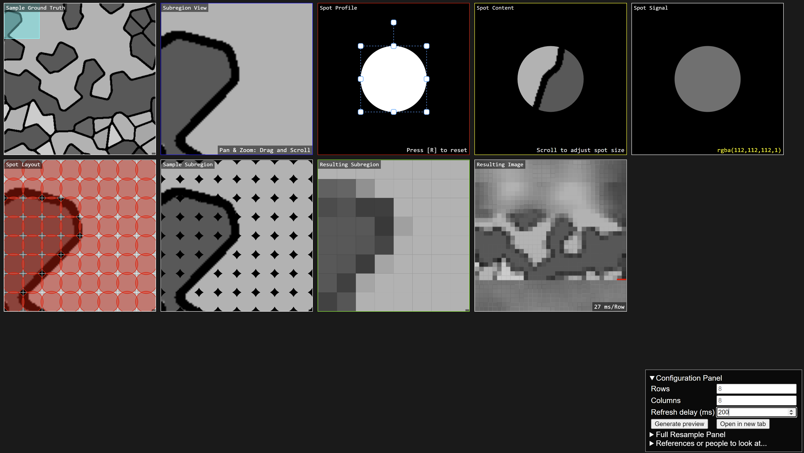

# ImageProbeSampler

### Stages / Boxes
1. Sample Ground Truth (map navigation)
2. Subregion View ("zoomed" view)
3. Spot Profile
4. Spot Content
5. Spot Signal (rgba)
6. Spot Layout
7. Sampled Subregion
8. Resulting Subregion
9. Resulting Image (full, "virtual SEM")

### To Do / Notes
- Minor pixel value differences in virtualSEM; improved, but could be due to sampling from  downsized sampling of the larger full image
- Update terms
 
### Screenshot

